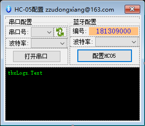
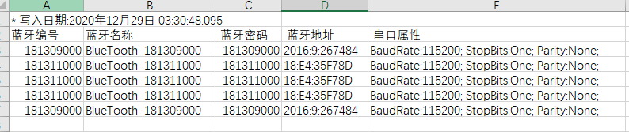

# HC05蓝牙模块批量配置工具

这是方便配置HC05蓝牙模块的软件助手, 主要配置蓝牙的名称与密码等信息

`开发平台`: VS2019

`开发技术`: C#, WinForm

`使用到的技术`: SerialPort

---



主要使用HC05蓝牙模块的AT模式读取蓝牙信息并配置蓝牙信息, 可实现自动增长编号, 并将配置后的数据记录到本地文件中

```C#
AT_Command.Add("AT");
//AT_Command.Add("AT+ORGL");
AT_Command.Add("AT+NAME=BlueTooth-" + Number);
AT_Command.Add("AT+PSWD=\"" + Number + "\"");
AT_Command.Add("AT+UART=" + BaudRate + ",0,0");
AT_Command.Add("AT+ADDR?");
```

通过修改以上内容可以实现配置HC05的其他设置

目前设置的内容为:

1. 设置蓝牙的名称
2. 设置蓝牙的连接密码
3. 设置蓝牙串口的波特率等信息(串口信息)
4. 读取蓝牙的地址(用于判断同批量的蓝牙模块是否有地址重复的情况)

配置完成后的蓝牙信息会保存在同目录下的csv文件中



## 其他

1. 本软件于2018年10月左右编写, 2020年才编写README, 很多地方介绍不是很详细
2. 如果有任何疑问欢迎下载源码讨论
3. 有其他疑问也可联系[作者](maileto:zzudongxiang@163.com)